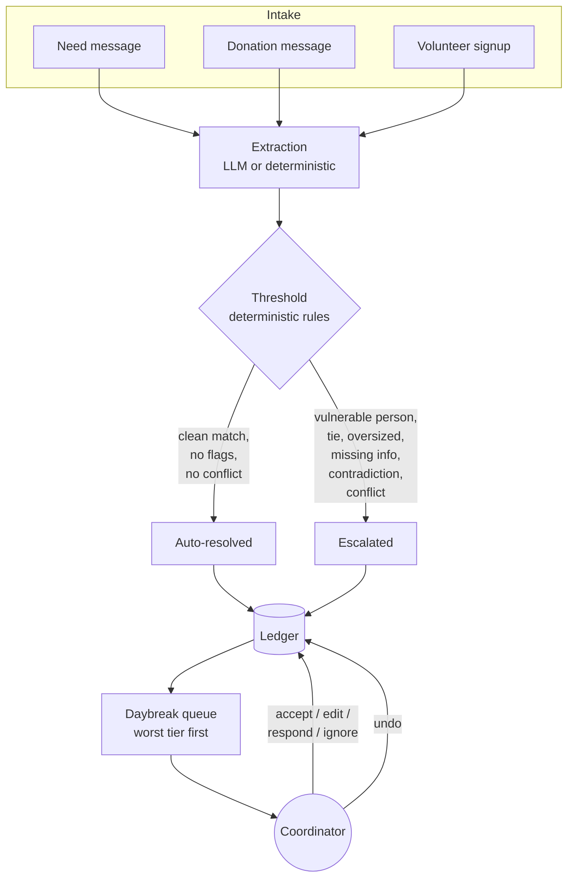
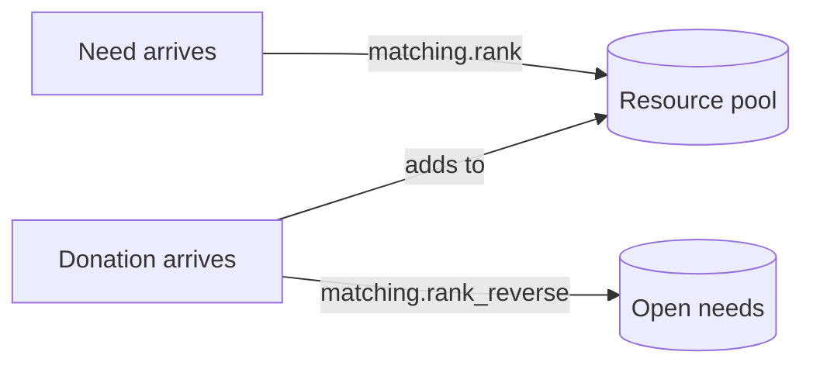

# Architecture

## Overview

One Strands `Agent`, one system prompt, one shared matching engine, and a
single deterministic safety layer that the model never gets to override.



## The core insight

Rotary coordinators juggle five nominally separate jobs — matching needs to
donations, routing donations to needs, assigning volunteer shifts, tracking
event RSVPs, and following up on whether help landed. They reduce to one
primitive:

> something comes in → try to resolve it automatically → escalate only when
> you can't do it confidently

Need-matching and donation-routing are the *same operation* run in opposite
directions against the same pool (`matching.rank` / `matching.rank_reverse`).
Volunteer shift assignment is the identical match-or-escalate pattern against
a different resource type — time instead of goods (`threshold.evaluate_shift`
mirrors `threshold.evaluate`).

## Extraction vs. decision — a hard boundary

The model's only job is turning free text into structured, confidence-scored
facts (`extract.py`, `Extraction` in `schema.py`). It never decides whether a
case can be handled automatically. That decision is made by pure functions in
`threshold.py` — no LLM call, no I/O, fully unit-tested — which take the
extraction and a ranked candidate list and return an outcome, a tier, and
every rule that was evaluated.

This split exists because a system that both reads the message and decides
its fate has no auditable boundary. When it's wrong, there's nothing to point
at. Here, every decision traces to a named rule with a literal statement of
what it checked.

## Structural safety, not prompted caution

The rule that matters most: **a case involving a vulnerable person has its
candidates withheld before the agent ever sees them.**

```python
candidates = matching.rank(extraction, pool)
candidates = threshold.filter_auto_matchable(extraction, candidates)  # <-- here
outcome, tier, rules, reason = threshold.evaluate(extraction, candidates)
```

`filter_auto_matchable` marks every candidate `blocked=True` when the
extraction carries a vulnerable flag. The agent is not told "be careful with
this one" — it is handed an empty, unusable option set. No prompt, no
jailbreak, no reasoning failure can produce an automatic assignment in that
case, because the information needed to make one was never in the tool's
return value.

The vulnerability check itself runs twice and is unioned, never intersected:
the model's own judgment, plus a deterministic keyword/age scan
(`threshold.detect_vulnerable_flags`) that runs regardless of what the model
says. Either one flagging something is enough.

`tests/test_threshold.py` proves this against a list of adversarial
messages, including deliberately awkward phrasing designed to slip past a
naive filter, and a control group of clean messages that must *not* be
flagged — a filter that flags everything is as useless as one that flags
nothing.

## Bidirectional matching, one engine



A donation searching open needs uses `filter_auto_matchable_reverse`, which
checks each *candidate's own* vulnerability flags rather than the donor
message's — a donation must not silently auto-link to a need that was
withheld for exactly the same reason a direct match would have been.

## Components

| File | Responsibility |
|---|---|
| `schema.py` | Pydantic models. Every extracted field carries `confidence` and `evidence`. |
| `extract.py` | The model's only job: message → `Extraction`. |
| `threshold.py` | Deterministic rules (T1–T9), pure functions, fully tested. |
| `matching.py` | RapidFuzz-based bidirectional scorer with an explained breakdown per candidate. |
| `pipeline.py` | Wires extraction → matching → threshold → ledger into `process_need`, `process_donation`, `process_shift_signup`. |
| `ledger.py` | Append-only decision record, receipt rendering, undo. |
| `triage.py` | Six-tier queue ordering, worst tier first, ascending confidence within a tier. |
| `tools.py` | Strands `@tool` wrappers around the pipeline. |
| `agent.py` | The `Agent`, system prompt, and Strands' native `HumanInTheLoop` gating on meta-actions. |
| `deterministic.py` | Rule-based extractor standing in for the model — the demo's insurance policy. |
| `store.py` | JSON-backed state, seeded from `data/`, reset on demand. |
| `app.py` | Streamlit UI. |
| `main.py` | CLI demo, live or deterministic. |

## Escalation policy

| Rule | Fires when | Tier |
|---|---|---|
| T1 vulnerable_person | any vulnerable flag present | Safety hold |
| T2 oversized_request | quantity > 20 | Contested |
| T3 contested_match | top two candidates within 10 points | Contested |
| T4 no_viable_match | best score < 75, or no candidates | Unmatched |
| T5 low_confidence_field | a required field's confidence < 0.70 | Urgent, incomplete |
| T6 missing_required_field | category, quantity, or requester_name absent | Urgent, incomplete |
| T7 contradiction | the message disagrees with itself | Contested |
| T8 shift_conflict | slot full, or volunteer double-booked | Contested |
| T9 skill_mismatch | volunteer lacks the shift's required skill | Contested |

Auto-resolve requires every rule to pass. Any single failure escalates —
there is no averaging, no majority vote, no partial credit.

## Model provider

Gemini via Strands' native provider (`strands.models.gemini.GeminiModel`),
not Amazon Bedrock. Bedrock model-access approval takes longer than this
project's timeline allowed — the same constraint several other teams in this
hackathon hit independently. Multiple API keys are rotated automatically on
rate-limit errors (`llm.py`), since Gemini's free tier caps at 5
requests/minute.

## What's stubbed, and why

`log_rsvp`, `check_event_capacity`, and `log_followup` exist as documented
tool signatures but aren't built out. Believable RSVP and follow-up
time-series data is hard to fabricate honestly, and the hackathon's own
judging guidance rewards depth on fewer flows over breadth across five
shallow ones. The matching and escalation engine — the two flows that share
one pool — is built completely; shift assignment reuses the identical
pattern. RSVP tracking and impact follow-up are designed to extend, not
demoed.
